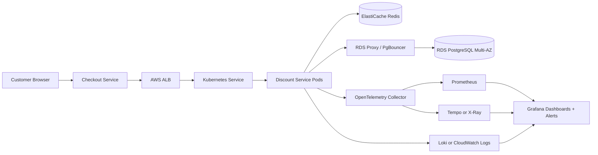
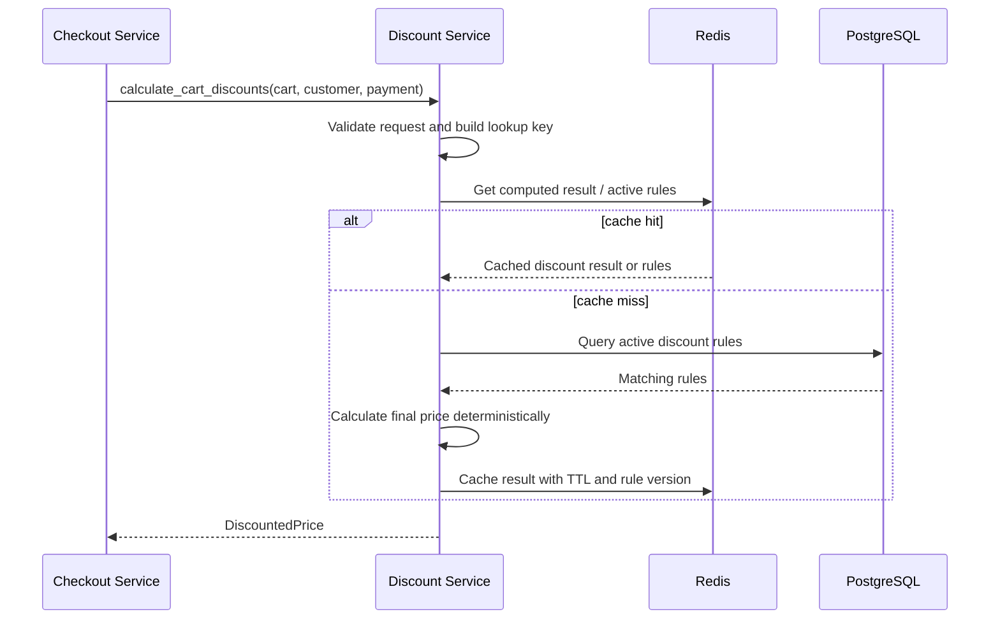
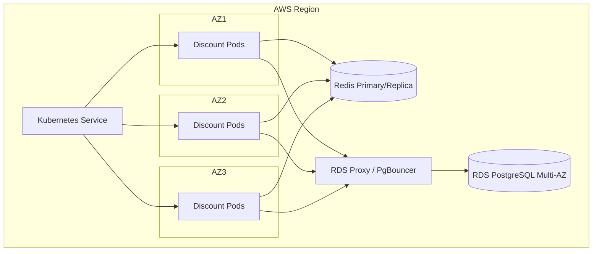
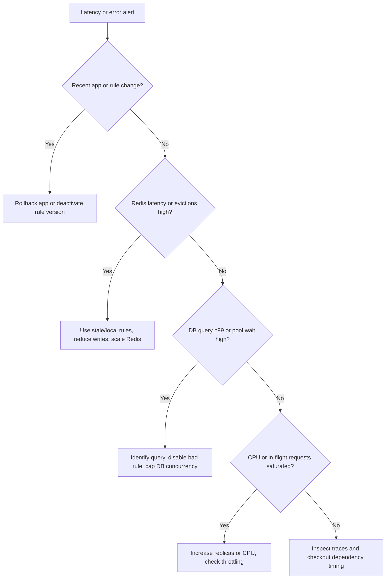

# Architecture

## Component Choices

| Component | Choice | Reason |
|---|---|---|
| Compute | EKS | Horizontal scaling, controlled rollouts, pod disruption controls |
| Ingress | AWS ALB | Managed L7 routing from checkout-facing services |
| Database | RDS PostgreSQL Multi-AZ | Strong consistency for discount rules and managed failover |
| DB pooling | RDS Proxy or PgBouncer | Protects PostgreSQL from pod-scaling connection storms |
| Cache | ElastiCache Redis | Low-latency cache for active rules and computed cart results |
| Metrics | Prometheus | Kubernetes-native scraping and histogram/SLO support |
| Dashboards | Grafana | On-call dashboards and alert visualization |
| Logs | Loki or CloudWatch Logs | JSON log search by request, trace, rule version, and outcome |
| Traces | OpenTelemetry with Tempo or X-Ray | Request-level visibility through cache, DB, and calculation spans |
| Delivery | GitHub Actions and Argo Rollouts | CI gates and progressive production rollout |
| Secrets | AWS Secrets Manager with External Secrets Operator | Rotation-friendly secret delivery to Kubernetes |

## High-Level Architecture

## Request Flow

## Kubernetes Topology

## Failure Decision Flow

