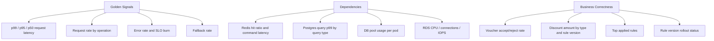

# Observability Plan

## Structured Logs

Logs are JSON. They must support incident response without leaking raw customer PII, payment details, or voucher codes. Customer IDs and voucher codes are hashed.

| Field | Reason |
|---|---|
| `timestamp` | Event time |
| `level` | `INFO`, `WARN`, `ERROR` |
| `service` | Always `discount-service` |
| `env`, `region`, `az` | Environment and infrastructure correlation |
| `request_id`, `trace_id`, `span_id` | Join logs with checkout and traces |
| `operation` | `calculate_cart_discounts` or `validate_discount_code` |
| `customer_hash` | Customer-specific debugging without PII |
| `cart_item_count` | Request complexity |
| `discount_types_requested` | Brand, bank, category, voucher |
| `voucher_hash` | Voucher debugging without raw code |
| `rule_version` | Detect bad rule rollout |
| `cache_result` | `hit`, `miss`, `stale_hit`, `bypass` |
| `db_query_count` | Detect N+1 query regressions |
| `duration_ms` | End-to-end service latency |
| `outcome` | `success`, `validation_failed`, `dependency_degraded`, `timeout`, `error` |
| `fallback_applied` | Whether degraded behavior was used |

Log levels:

- `INFO`: one request completion log per request.
- `WARN`: stale cache use, fallback behavior, dependency latency above threshold, suspicious voucher patterns.
- `ERROR`: failed request, uncaught exception, invalid rule state, database unavailable, Redis unavailable without fallback.

Example successful request:

```json
{"timestamp":"2026-06-02T08:15:23.421Z","level":"INFO","service":"discount-service","env":"prod","region":"ap-south-1","az":"ap-south-1a","request_id":"req_7f92","trace_id":"4b7d0f","operation":"calculate_cart_discounts","customer_hash":"cust_9a41","cart_item_count":3,"discount_types_requested":["brand","category","bank"],"rule_version":"2026-06-02.14","cache_result":"hit","db_query_count":0,"duration_ms":18,"outcome":"success","fallback_applied":false}
```

Example degraded success:

```json
{"timestamp":"2026-06-02T08:16:02.118Z","level":"WARN","service":"discount-service","env":"prod","request_id":"req_8431","trace_id":"1ca90d","operation":"calculate_cart_discounts","cart_item_count":6,"discount_types_requested":["brand","category","voucher"],"voucher_hash":"vch_71ac","rule_version":"2026-06-02.14","cache_result":"stale_hit","db_query_count":1,"db_duration_ms":96,"duration_ms":128,"outcome":"success","fallback_applied":true,"fallback_reason":"postgres_slow_stale_rules_used"}
```

Example timeout:

```json
{"timestamp":"2026-06-02T08:17:44.002Z","level":"ERROR","service":"discount-service","env":"prod","request_id":"req_91de","trace_id":"d9a33e","operation":"validate_discount_code","voucher_hash":"vch_4432","cache_result":"miss","db_query_count":1,"duration_ms":151,"outcome":"timeout","fallback_applied":false,"error_code":"voucher_validation_timeout"}
```

## Metrics

### RED Metrics

| Metric | Type | Labels | Why |
|---|---|---|---|
| `discount_requests_total` | Counter | `operation`, `outcome`, `discount_type` | Request rate and success/failure split |
| `discount_request_duration_seconds` | Histogram | `operation`, `outcome` | Main latency SLI and p50/p95/p99 visibility |
| `discount_errors_total` | Counter | `operation`, `error_code` | Alerting and error budget burn |

### Dependency Metrics

| Metric | Type | Labels | Why |
|---|---|---|---|
| `discount_redis_operations_total` | Counter | `operation`, `outcome` | Cache health and hit/miss behavior |
| `discount_redis_duration_seconds` | Histogram | `operation` | Redis latency can dominate p99 |
| `discount_db_queries_total` | Counter | `query_type`, `outcome` | Query volume and failure rate |
| `discount_db_query_duration_seconds` | Histogram | `query_type` | Finds slow rule lookups and index regressions |
| `discount_db_pool_in_use` | Gauge | `pod` | Detects pool saturation before requests fail |

### Business Metrics

| Metric | Type | Labels | Why |
|---|---|---|---|
| `discount_amount_total` | Counter | `discount_type`, `rule_version` | Detects over-discounting after rule rollout |
| `discount_applied_total` | Counter | `discount_type`, `rule_id`, `rule_version` | Shows active rules and unexpected drops |
| `voucher_validation_total` | Counter | `outcome`, `rule_version`, `voucher_campaign_id` | Valid voucher rejection spikes are customer-visible |
| `discount_fallback_total` | Counter | `fallback_type` | Measures degraded behavior |
| `rule_version_active` | Gauge | `rule_version` | Confirms rollout state |

### USE Metrics

- Pod CPU utilization and throttling.
- Pod memory working set and OOM kills.
- Pod network I/O and connection count.
- RDS CPU, read IOPS, write IOPS, connections, slow queries.
- Redis CPU, memory, evictions, command latency, keyspace hit ratio.

## Tracing

Use OpenTelemetry and propagate trace context from checkout.

Important spans:

- `discount.calculate_cart_discounts`
- `discount.validate_discount_code`
- `cache.get_rules`
- `cache.get_computed_result`
- `db.query_discount_rules`
- `discount.apply_rules`
- `cache.set_computed_result`

Important attributes:

- `operation`
- `cart.item_count`
- `discount.types`
- `payment.method`
- `payment.bank_hash` or bucketed bank field
- `voucher.present`
- `voucher.hash`
- `cache.result`
- `db.query_count`
- `rule.version`
- `fallback.applied`
- `fallback.reason`

Healthy trace:

```text
checkout.price_cart 42ms
  discount.calculate_cart_discounts 24ms
    cache.get_computed_result 3ms cache.result=miss
    cache.get_rules 4ms cache.result=hit rule.version=2026-06-02.14
    discount.apply_rules 6ms cart.item_count=3
    cache.set_computed_result 2ms
```

Unhealthy trace:

```text
checkout.price_cart 184ms
  discount.calculate_cart_discounts 159ms fallback.applied=true
    cache.get_computed_result 6ms cache.result=miss
    cache.get_rules 7ms cache.result=miss
    db.query_discount_rules 118ms query_type=active_rules_by_category outcome=slow
    discount.apply_rules 9ms
```

## Dashboard



On-call checks first:

1. p99 latency and error-budget burn for `calculate_cart_discounts`.
2. Redis and PostgreSQL panels to identify dependency pressure.
3. Voucher and discount amount panels to detect correctness incidents.

