# CI/CD And Change Safety

## Pipeline

```mermaid
flowchart LR
    PR[Pull Request] --> Static[Lint, type checks, unit tests]
    Static --> Security[SAST, dependency scan, secret scan]
    Security --> Contract[API contract tests]
    Contract --> Logic[Golden discount calculation tests]
    Logic --> Build[Build signed container image]
    Build --> Stage[Deploy to staging]
    Stage --> Load[Smoke + focused load test]
    Load --> Canary[Production canary]
    Canary --> Rollout[Progressive rollout]
    Rollout --> Monitor[Post-deploy SLO and business guardrails]
```

## Gates

- PR requires review from service owner for calculation logic.
- Rule schema or query changes require database review.
- Golden cart tests must pass.
- Dependency vulnerabilities above agreed severity block release unless explicitly waived.
- Staging smoke tests must validate Redis and PostgreSQL integration.
- Canary must pass latency, error, fallback, and discount-amount guardrails.

## Safe Rollout For Discount Logic

Controls:

- Version calculation logic and discount rules.
- Use historical cart fixtures with expected outputs.
- Run shadow evaluation on a sample of production traffic.
- Compare current and candidate outputs without changing customer result.
- Emit diff buckets, not raw PII cart details.
- Roll out through 1%, 5%, 25%, then 100%.

Automatic rollout stop conditions:

- p99 latency exceeds 150 ms for two 5-minute windows.
- Error rate exceeds 0.1% for 5 minutes.
- Fallback rate rises above 2x baseline.
- Average discount amount for canary moves outside campaign guardrails.
- Voucher rejection rate for a campaign exceeds 3x baseline with meaningful volume.

## Rollback

Targets:

- App rollback: under 10 minutes.
- Rule rollback: under 5 minutes.

Mechanisms:

- Argo Rollouts or Kubernetes rollout undo for app versions.
- Immutable signed images.
- Rule activation by version so bad rules can be deactivated without app deploy.
- Cache keys include rule version to avoid incompatible cached results after rollback.
- Emergency cache invalidation for bad rule version.

## Security And Supply Chain

- Secret scanning in PR.
- SAST for Python.
- Dependency scanning with OSV, Snyk, or Dependabot.
- Container image scan before deploy.
- SBOM generation.
- Image signing with admission control for signed images only.
- Runtime service account with least-privilege IAM.
- Database credentials in AWS Secrets Manager via External Secrets Operator.
- Kubernetes network policies allowing only required ingress from checkout and egress to Redis, PostgreSQL, and telemetry.

