# Diagrams

This file collects the main system, request, deployment, observability, CI/CD, and incident-flow diagrams for the discount calculation service.

## Picture Diagrams

These SVG diagrams render as images in GitHub:

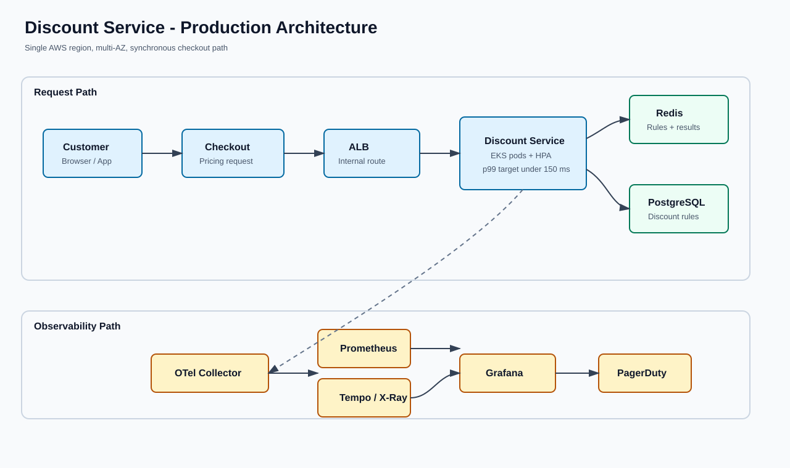

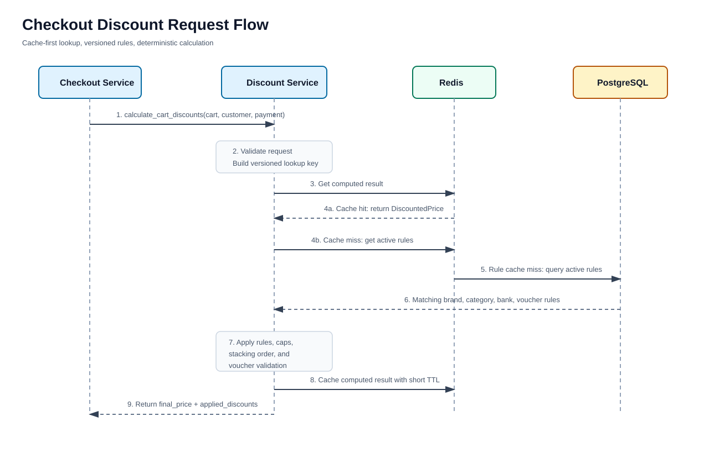

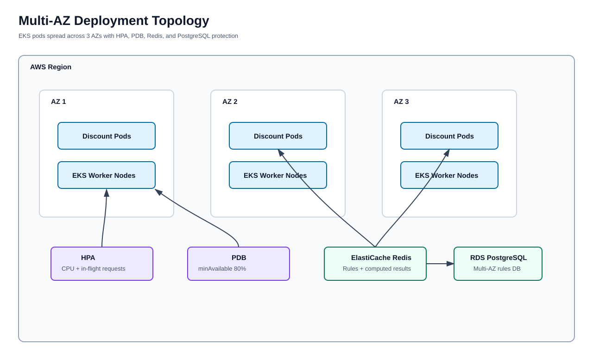

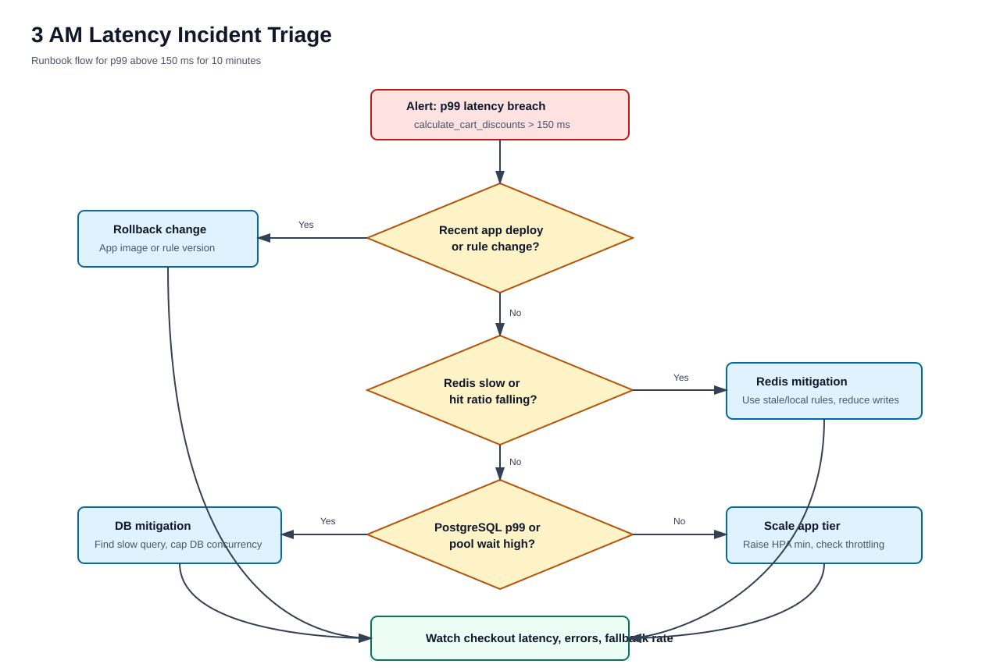

## 1. System Architecture

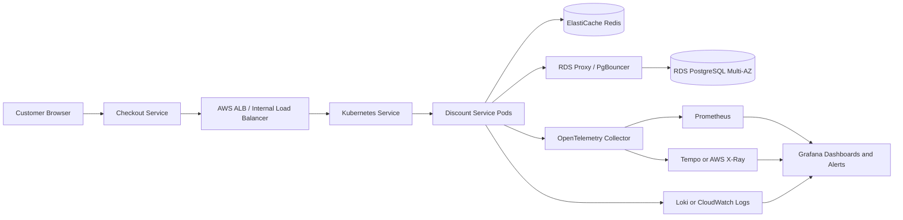

## 2. Checkout Request Flow

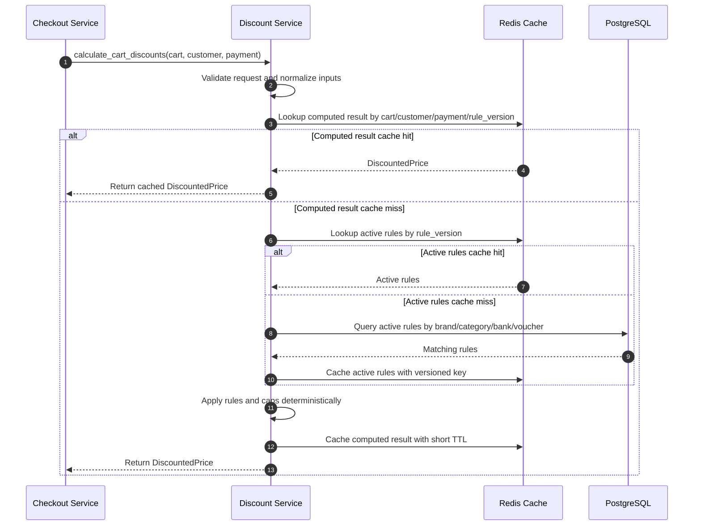

## 3. Multi-AZ Kubernetes Deployment

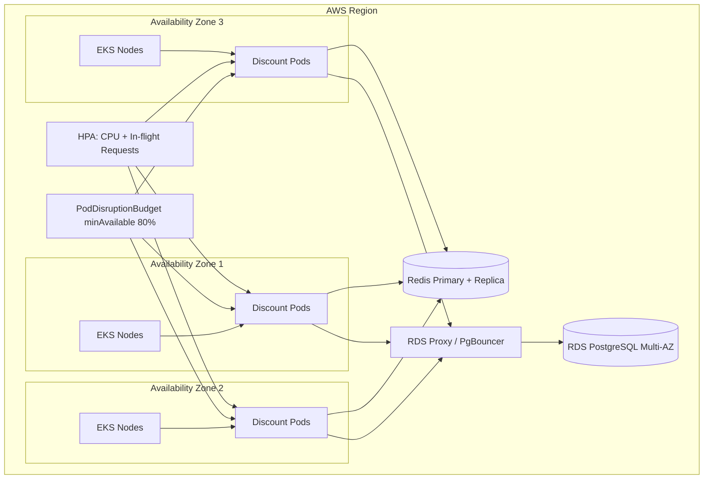

## 4. Observability Data Flow

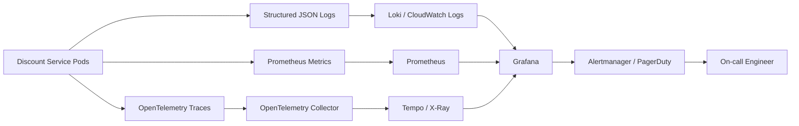

## 5. Grafana Dashboard Layout

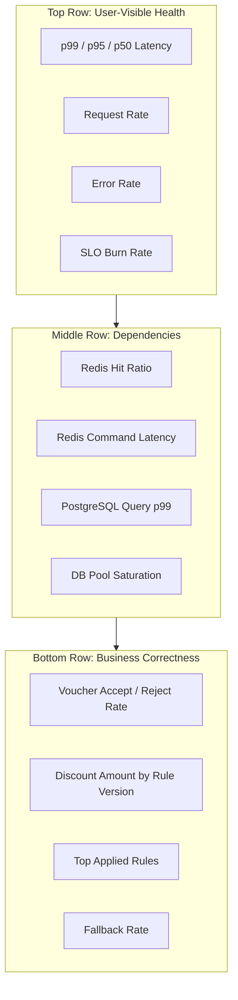

## 6. CI/CD And Progressive Delivery

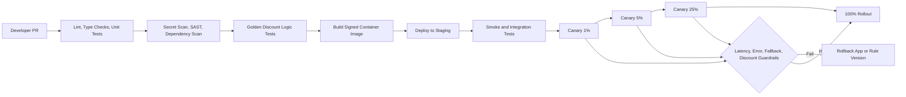

## 7. Latency Incident Triage

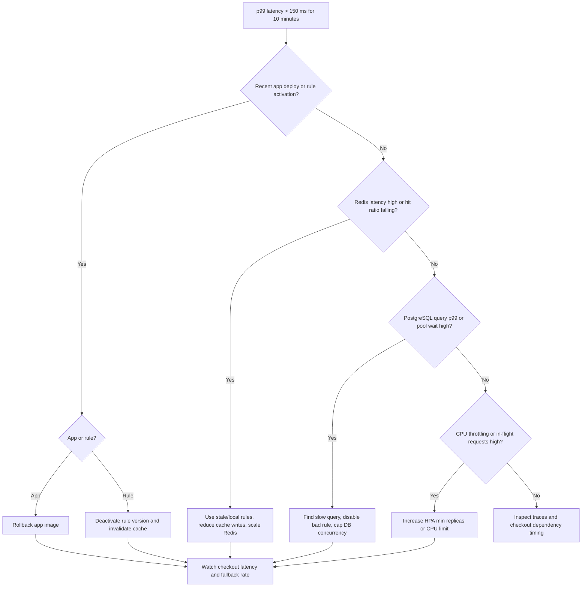

## 8. Dependency Degradation Behavior

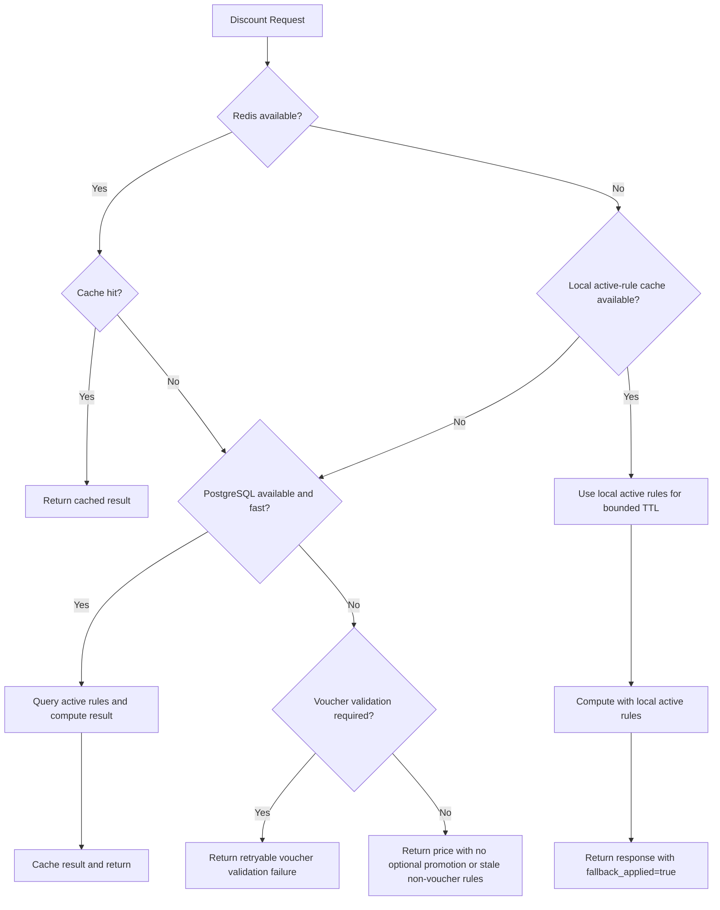
